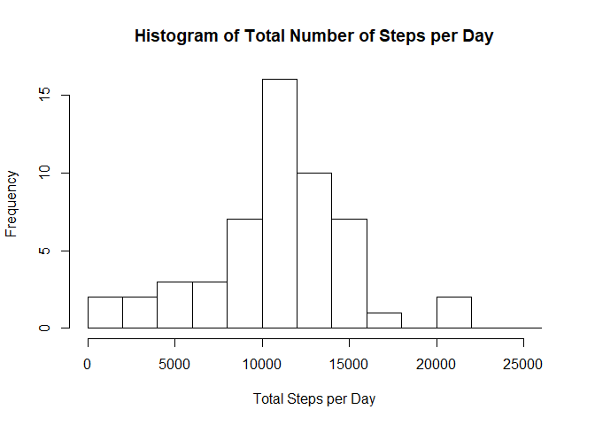
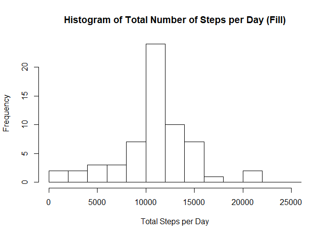
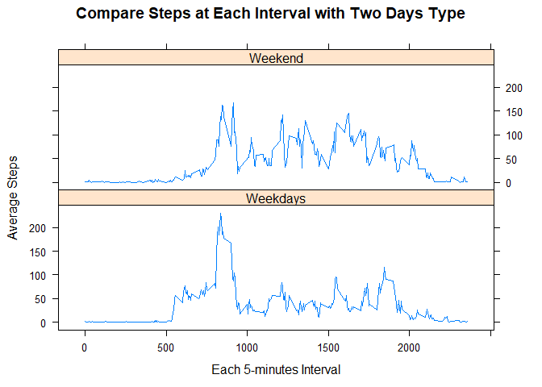

# Reproducible Research: Peer Assessment 1
This is my first an R Markdown file. And with project RepData Course Project 1

## Loading and preprocessing the data
* 1.Load the data (i.e. read.csv())
* 2.Process the data


```r
dat_activity <- read.csv("activity.csv")
```

## What is mean total number of steps taken per day?

### 1.Calculate the total number of steps taken per day

```r
totalStepsPerDay <- aggregate(steps ~ date, 
data = dat_activity,
FUN = sum)
```

### 2.Make a histogram of the total number of steps taken each day

```r
hist(totalStepsPerDay$steps,xlab = "Total number of steps per day",
     main = "Histogram of total number of steps per day in US",
     breaks = seq(0, 26000, 2000))
```

<!-- -->

### 3.Calculate and report the mean and median of the total number of steps taken per day

```r
mean(totalStepsPerDay$steps)
```

```
## [1] 10766.19
```

```r
median(totalStepsPerDay$steps)
```

```
## [1] 10765
```

## What is the average daily activity pattern?
### 1.Make a plot (i.e. type = "l") of the 5-minute interval (x-axis) and the average number of steps taken, averaged across all days (y-axis)

```r
stepsPerInterval <- aggregate(steps ~ interval, data = dat_activity,
                              FUN = mean)
with(stepsPerInterval,plot(x = interval,y = steps,type="l"))
```

<!-- -->

### 2.Which 5-minute interval, on average across all the days in the dataset, contains the maximum number of steps?

```r
maxStepsInterval <- stepsPerInterval$interval[which.max(stepsPerInterval$steps)]
print(maxStepsInterval)
```

```
## [1] 835
```

## Imputing missing values
### 1.Calculate and report the total number of missing values in the dataset (i.e. the total number of rows with NAs)

```r
missing <- nrow(dat_activity[is.na(dat_activity),])
print(missing)
```

```
## [1] 2304
```

### 2.Devise a strategy for filling in all of the missing values in the dataset. 
### 3.Create a new dataset that is equal to the original dataset but with the missing data filled in.

```r
fill_activity <- dat_activity
for (i in 1:nrow(fill_activity)) {
    if(is.na(fill_activity$steps[i])) {
        fill_activity$steps[i] <- stepsPerInterval$steps[
            which(stepsPerInterval$interval == 
                      fill_activity$interval[i])]
    }
}
```

### 4.Make a histogram of the total number of steps taken each day

```r
totalStepsPerDayFill <- aggregate(steps ~ date, data = fill_activity,
                              FUN = sum)
hist(totalStepsPerDayFill$steps,xlab = "Total number of steps per day",
     main = "Histogram of total number of steps per day (fill)",
     breaks = seq(0, 26000, 2000))
```

<!-- -->

### Calculate and report the mean and median total number of steps taken per day

```r
mean(totalStepsPerDayFill$steps)
```

```
## [1] 10766.19
```

```r
median(totalStepsPerDayFill$steps)
```

```
## [1] 10766.19
```

### Do these values differ from the estimates from the first part of the assignment? What is the impact of imputing missing data on the estimates of the total daily number of steps?
It does not seen to change to much about mean between fill or not fill data. But medians of them have change little bit.

### Are there differences in activity patterns between weekdays and weekends?
### 1.Create a new factor variable in the dataset with two levels – “weekday” and “weekend” indicating whether a given date is a weekday or weekend day.


```r
#at first change language to English by default
Sys.setlocale("LC_ALL","English")
fill_activity$daytype <- "Weekdays"
fill_activity$daytype[weekdays(as.Date(fill_activity$date)) %in% c("Saturday", "Sunday")] <- "Weekend"
```

### 2.Make a panel plot of all weekday days or weekend days

```r
library(lattice)
interStepsAllDayType <- aggregate(steps ~ interval * daytype,
                                  data = fill_activity,
                                  FUN = mean)
xyplot(steps~interval | daytype ,
       data = interStepsAllDayType,
       layout=c(1,2),type="l",main="Compare steps by interval of two days type")
```

<!-- -->


